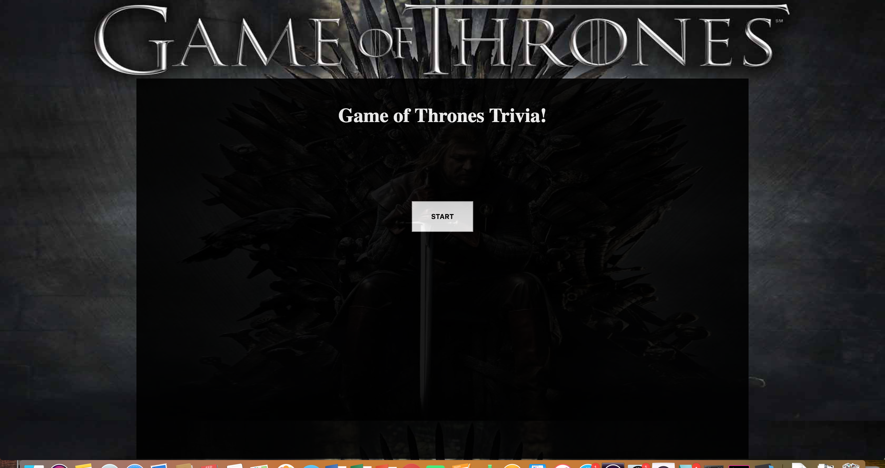

# Trivia Game

Welcome young Nights Watch acolyte! In this challenge of wit and discipline, you must answer to the best of your ability questions about the history of the seven kingdoms.

## Instructions
When you have studied the tomes Maester Aemon lent you and cleaned the troughs, you may begin the exam.

  

Upon clicking, a random question will appear to you. Be Hasty, young one! You only get thirty seconds to answer each questions. There are ten questions in total. When you answer a question, or fail to answer at all, the correct answer and a relevant image will appear to you. Once you finish the test, your results will be show.

Because we are 
