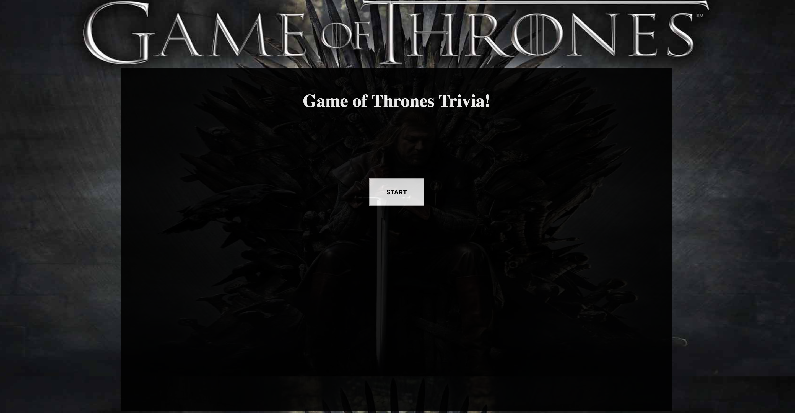
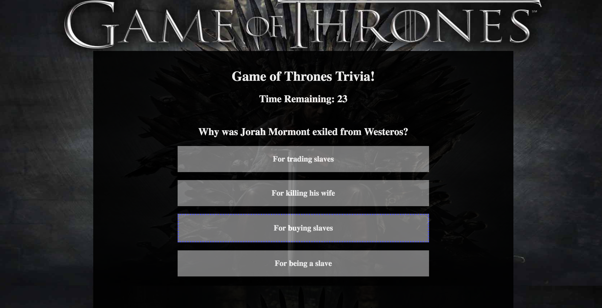
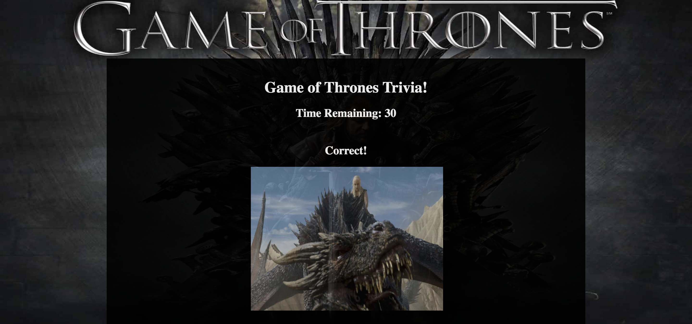
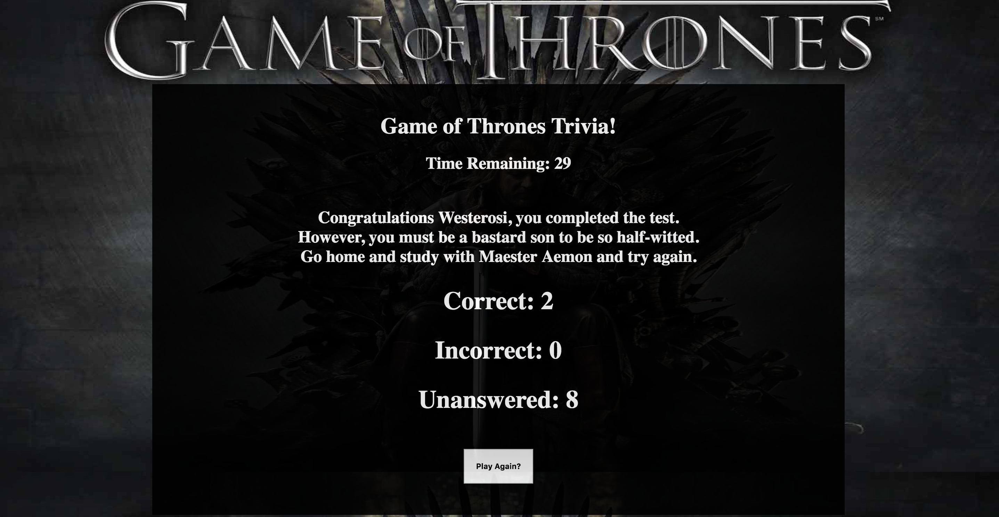

# Trivia Game

Welcome young Nights Watch acolyte! In this challenge of wit and discipline, you must answer to the best of your ability questions about the history of the seven kingdoms.

## Instructions
When you have studied the tomes Maester Aemon lent you and cleaned the troughs, you may begin the exam.

You will see this screen before starting:

  

Upon clicking, a random question will appear to you. Be Hasty, young one! You only get thirty seconds to answer each questions. Below is the screen asking each question:

  

There are ten questions in total. When you answer a question, or fail to answer at all, the correct answer and a relevant image will appear to you displayed below: 

  

Once you finish the test, your results will be show as such:

  

As you can see, this neophyte did not study as he was instructed. However this is not the Citadel and our members are not expected to be THAT intelligent. Just get more than half right and you will pass. 

# Good Luck and let the Gods, old and new, be with you!
